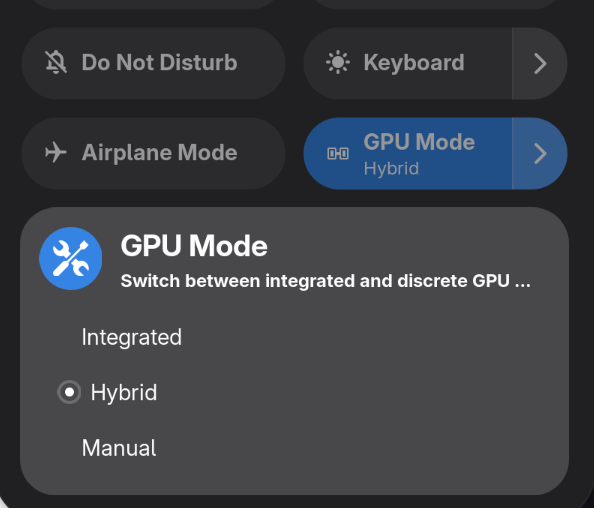

# Cardwire Toggle - GNOME Shell Extension



A Quick Settings toggle for [cardwire](https://github.com/OpenGamingCollective/cardwire),
the eBPF-based Linux GPU manager. Mirrors the UX of the Power Profiles Daemon tile:
click to flip between Integrated and Hybrid, expand for the full mode list.

Tested against cardwire 0.9.0 on NixOS with GNOME 50 on an Asus G14 (2025).

## How it works

The extension talks to the `cardwired` system daemon directly over D-Bus -
no `pkexec`, no shelling out to the CLI. cardwired's D-Bus policy is open
on the system bus, so calls go through silently.

Mode changes initiated from anywhere that uses `cardwire set …` from a terminal or other tool are detected via a dbus event watcher, no polling necessary.

## Requirements
Gnome Shell 45 or newer

[cardwire](https://github.com/OpenGamingCollective/cardwire) must be installed and the daemon service must be running.

## Installation

### Gnome Extensions

Download directly from the [Gnome Extensions Page](https://extensions.gnome.org/extension/9919/cardwire-gpu-toggle/)

### Manually

You can manually install the extension from the zip file under the releases.
The following commands will install it locally for your user
```
curl -L "https://github.com/chrispouliot/cardwire-toggle/releases/latest/download/cardwire-toggle@chrispouliot.github.io.shell-extension.zip" \
  -o /tmp/cardwire-toggle.zip

gnome-extensions install --force /tmp/cardwire-toggle.zip

# log out, log back in, then:
gnome-extensions enable cardwire-toggle@chrispouliot.github.io
```

### NixOS Flake

This project includes a flake.nix which allows it to be imported through a users nix flake configuration. Add it to your own flake.nix as follows

```
{
  description = "My configuration";

  inputs = {
    nixpkgs.url = "github:NixOS/nixpkgs/nixos-unstable";
    # Any other flake installations, including cardwire if installed through flake. Remember to enable it in configuration.nix
    # [...]

    # Cardwire toggle extension
    cardwire-toggle = {
      url = "github:chrispouliot/cardwire-toggle";
      inputs.nixpkgs.follows = "nixpkgs";
    };
  };

  outputs = { nixpkgs, cardwire-toggle, ... }@inputs: {
    nixosConfigurations = {
      nixos = nixpkgs.lib.nixosSystem {
        system = "x86_64-linux";
        modules = [
          cardwire-toggle.nixosModules.default # Add the extension toggle here, this combines it with your configuration.nix
          ./configuration.nix
        ];
      };
    };
  };
}

```
